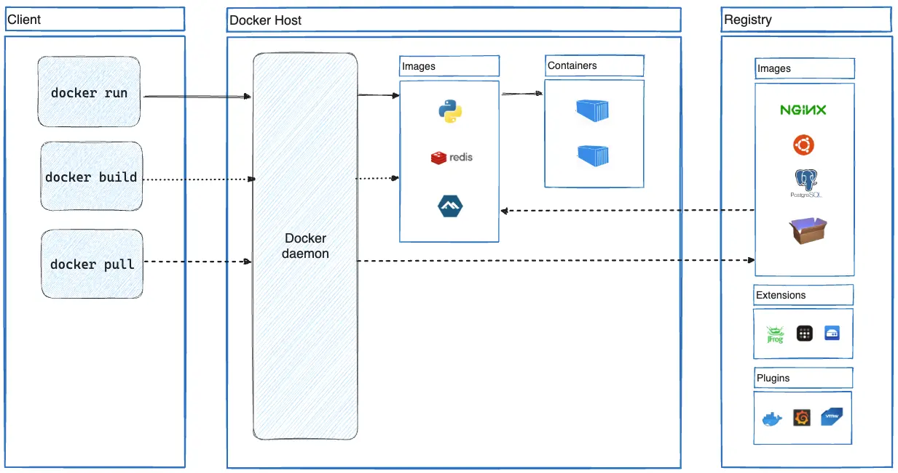

# What is Docker?
Docker is an open-source platform that automates the deployment of applications inside software containers. These containers are lightweight, portable, and self-sufficient, allowing applications to run seamlessly in any environment. Docker also enables the separation of applications from infrastructure, facilitating faster software delivery. By leveraging Docker’s methodologies for shipping, testing, and deploying code, you can significantly reduce the time between writing code and running it in production.

# Why use Docker?
- Fast, consistent delivery of the applications
- Responsive deployment and scaling
- Running more workloads on the same hardware
- Isolation of applications

# Docker Architecture

## Standard definitions
- **Docker Engine** - A client-server application with these major components:
  - A server, which is a type of long-running program called a daemon process (the `dockerd` command).
  - A REST API which specifies interfaces that programs can use to talk to the daemon and instruct it what to do.
  - A command-line interface (CLI) client (the `docker` command).
- **Docker client** - The command-line tool that allows the user to interact with the Docker daemon.
- **Docker daemon** - A background service that manages Docker objects such as images, containers, networks, and volumes.
- **Docker registries** - Stores Docker images. Docker Hub is a public registry that anyone can use, and Docker is configured to look for images on Docker Hub by default. You can run your own private registry or use other public registries.
- **Docker objects** - Images, containers, networks, and volumes are the objects that Docker works with.
- **Dockerfile** - A Dockerfile is a text document containing all the commands required to generate a specific image that is read by Docker to build that image automatically.
- **Docker image** - A read-only file that contains all the necessary instructions for creating a container. They are used to create and start new containers at runtime.
- **Docker container** - A lightweight, standalone, executable package that contains everything needed to run an application, including the code, a runtime, libraries, environment variables, and config files.

## Advantages
- Dockerfiles make configuring and packaging apps and their environments really easy.
- The Docker Hub makes sharing images with anyone in the world effortless.
- The Docker CLI makes it easy to start your apps in containers.
